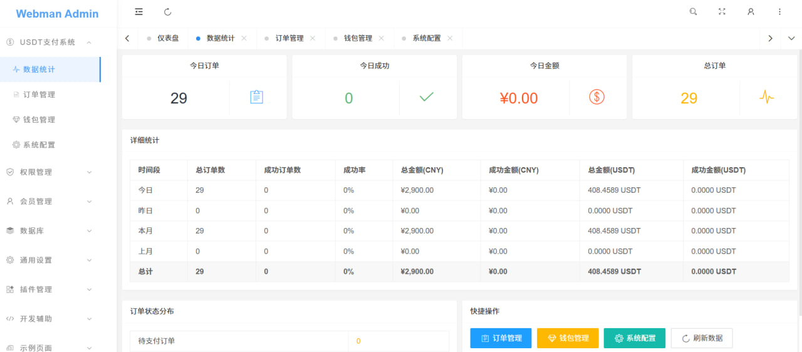
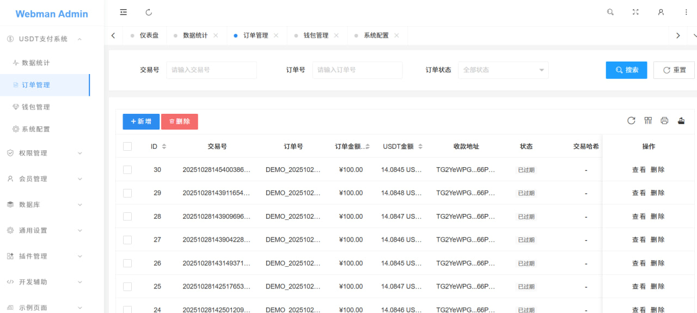
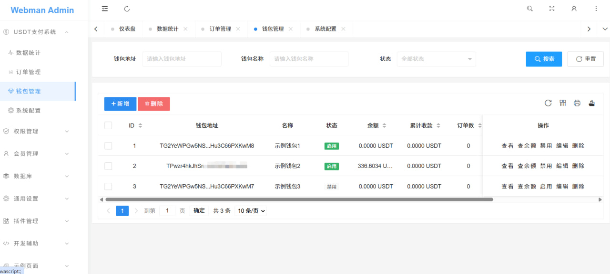
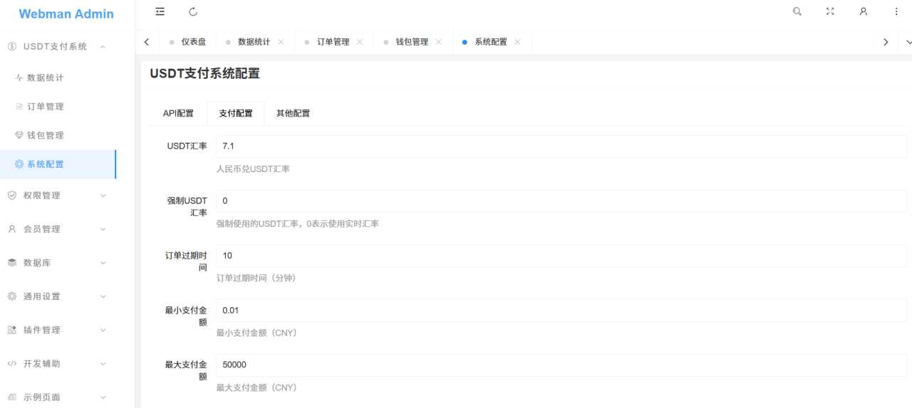
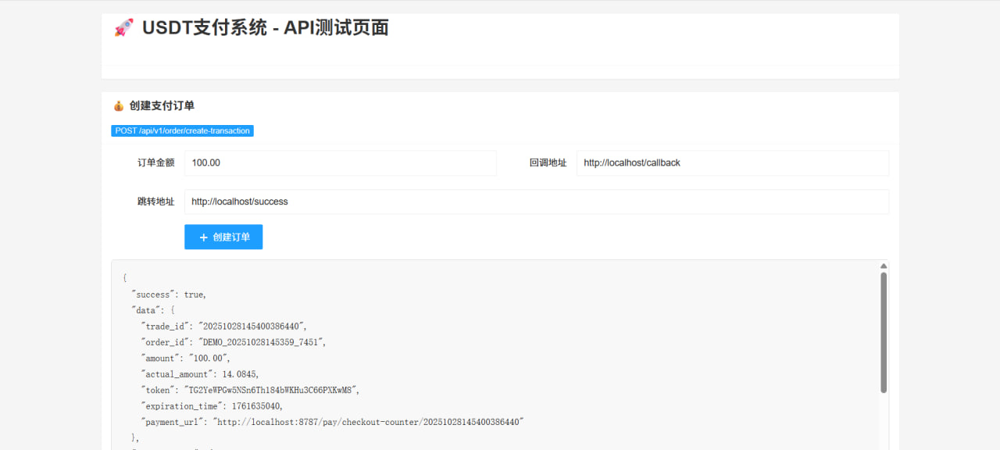
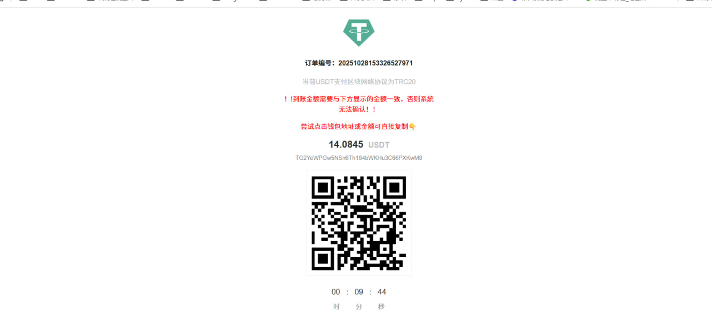

# Webman USDT Payment System

<div align="center">


**基于 Webman 框架的 USDT-TRC20 支付系统**

一个高性能、易部署的 USDT 支付解决方案

</div>

## 📋 项目简介

Webman USDT Payment System 是一个基于 Webman 高性能框架开发的 USDT-TRC20 支付系统。系统提供完整的支付流程管理，包括订单创建、支付监控、余额查询、回调通知等功能。

### ✨ 主要特性

- 🚀 **高性能**: 基于 Webman 框架，支持高并发处理
- 💰 **USDT-TRC20**: 支持波场网络 USDT 支付
- 🔄 **实时监控**: 自动监控区块链交易状态
- 📊 **管理后台**: 完整的订单和钱包管理界面
- 🔐 **安全可靠**: MD5 签名验证，防止恶意请求
- 📱 **响应式**: 支持移动端支付页面
- 🔔 **回调通知**: 支付成功后自动回调商户系统
- 📈 **数据统计**: 详细的订单和收入统计

## 🏗️ 系统架构

```
webman-usdt-payment/
├── app/                    # 应用核心代码
│   ├── controller/         # 控制器
│   ├── model/             # 数据模型
│   ├── service/           # 业务服务
│   ├── process/           # 后台进程
│   └── view/              # 视图模板
├── plugin/                # 插件目录
│   └── admin/             # 管理后台插件
├── config/                # 配置文件
├── database/              # 数据库文件
├── docs/                  # 文档目录
├── public/                # 静态资源
└── runtime/               # 运行时文件
```

## 🚀 快速开始

### 环境要求

- PHP >= 8.0
- MySQL >= 5.7
- Redis >= 5.0
- Composer
- 支持 cURL 扩展

### 安装步骤

1. **克隆项目**
```bash
git clone https://github.com/your-repo/webman-usdt-payment.git
cd webman-usdt-payment
```

2. **安装依赖**
```bash
composer install
```

3. **配置环境**
```bash
cp .env.example .env
# 编辑 .env 文件，配置数据库和Redis连接
```

4. **导入数据库**
```bash
mysql -u root -p your_database < database/usdt_payment.sql
```

5. **启动服务**
```bash
php start.php start -d
```

## 📚 部署文档

我们提供了详细的部署文档，支持多种环境：

- 📖 [Linux 环境部署](docs/DEPLOY_LINUX.md) - 适用于 Ubuntu/CentOS 等 Linux 系统
- 🎛️ [宝塔面板部署](docs/DEPLOY_BAOTA.md) - 适用于宝塔面板用户
- 🔧 [API 对接文档](docs/API_DOCUMENTATION.md) - 开发者集成指南

## 🎯 核心功能

### 💳 支付流程

1. **创建订单**: 商户通过API创建支付订单
2. **生成支付页面**: 系统生成包含二维码的支付页面
3. **用户支付**: 用户扫码转账USDT到指定地址
4. **交易监控**: 系统自动监控区块链交易
5. **状态更新**: 检测到支付后更新订单状态
6. **回调通知**: 向商户系统发送支付成功通知

### 🛠️ 管理功能

- **订单管理**: 查看、搜索、统计所有支付订单
- **钱包管理**: 管理收款钱包地址和余额
- **数据统计**: 收入统计和趋势分析
- **系统配置**: 支付参数和回调设置

### 🔌 API接口

- `POST /api/create-order` - 创建支付订单
- `POST /api/query-order` - 查询订单状态
- `POST /api/get-rate` - 获取汇率信息
- `GET /payment/{trade_id}` - 支付页面

## 📊 系统截图

### 🎛️ 管理后台

#### 数据统计大屏

*实时数据统计，包含今日订单、成功率、收入金额等关键指标*

#### 订单管理界面

*完整的订单管理功能，支持搜索、筛选和状态查看*

#### 钱包管理界面

*钱包地址管理，实时余额查询和状态控制*

#### 系统配置界面

*灵活的系统参数配置，支持汇率、金额限制等设置*

### 🔧 API测试页面

*内置API测试工具，方便开发者调试和集成*

### 💳 支付页面

*简洁美观的支付界面，支持二维码扫码支付和倒计时显示*

## 🔧 配置说明

### 主要配置项

```php
// config/usdt.php
return [
    'api_key' => 'your_api_key',           // API密钥
    'api_secret' => 'your_api_secret',     // API签名密钥
    'callback_url' => 'your_callback_url', // 回调地址
    'order_timeout' => 1800,               // 订单超时时间(秒)
    'min_amount' => 1,                     // 最小支付金额
    'max_amount' => 50000,                 // 最大支付金额
];
```

### 钱包配置

系统支持多钱包轮询，在管理后台添加TRC20钱包地址即可自动分配。

## 🔒 安全特性

- **签名验证**: 所有API请求都需要MD5签名验证
- **IP白名单**: 支持限制回调IP地址
- **订单超时**: 自动处理超时订单
- **重复检测**: 防止重复支付和回调

## 📈 性能优化

- **Redis缓存**: 缓存汇率和配置信息
- **异步处理**: 区块链监控和回调通知异步执行
- **连接池**: 数据库连接复用
- **内存优化**: 合理的内存使用策略

## 🐛 故障排除

### 常见问题

1. **订单创建失败**
   - 检查API密钥配置
   - 验证请求签名算法
   - 确认参数格式正确

2. **支付监控异常**
   - 检查TronScan API连接
   - 验证钱包地址格式
   - 查看进程运行状态

3. **回调失败**
   - 检查回调URL可访问性
   - 验证商户接收接口
   - 查看回调日志

### 日志查看

```bash
# 查看应用日志
tail -f runtime/logs/webman.log

# 查看错误日志
tail -f runtime/logs/error.log
```

## 🤝 技术支持

如果您在使用过程中遇到任何问题，可以通过以下方式获取帮助：

- 📧 **开发者联系**: [@oop7788](https://t.me/oop7788)
- 👥 **技术交流群**: [@es_usdt_pay](https://t.me/es_usdt_pay)
- 📝 **Issues**: 在GitHub仓库提交问题
- 📖 **文档**: 查看详细的部署和API文档

## ⚠️ 免责声明

本项目仅供学习和技术交流使用，使用者需要遵守以下条款：

### 法律合规
- 使用本系统前，请确保您所在地区的法律法规允许此类支付系统的运营
- 用户需自行承担使用本系统可能产生的法律风险和责任
- 开发者不对因使用本系统而产生的任何法律纠纷承担责任

### 技术风险
- 本系统涉及数字货币交易，存在价格波动、网络延迟等技术风险
- 用户应充分了解区块链技术的特性和风险
- 建议在生产环境使用前进行充分的测试和安全评估

### 使用限制
- 禁止将本系统用于任何违法违规的活动
- 禁止用于洗钱、诈骗、赌博等非法用途
- 用户应确保业务合规，遵守相关金融监管要求

### 技术支持
- 本项目按"现状"提供，不提供任何明示或暗示的担保
- 开发者不对系统的稳定性、安全性、准确性做出保证
- 技术支持仅限于开源代码本身，不包括商业咨询

**使用本系统即表示您已阅读、理解并同意上述免责声明的所有条款。**

## 📄 开源协议

本项目采用 MIT 协议开源，详情请参阅 [LICENSE](LICENSE) 文件。

## 🙏 致谢

感谢以下开源项目的支持：

- [Webman](https://www.workerman.net/webman) - 高性能PHP框架
- [Workerman](https://www.workerman.net/) - 高性能PHP Socket框架
- [Layui](https://layui.dev/) - 前端UI框架
- [TronScan](https://tronscan.org/) - 波场区块链浏览器

---

<div align="center">

**⭐ 如果这个项目对您有帮助，请给我们一个Star！**

Made with ❤️ by [EsUsdt](https://t.me/oop7788)

</div>